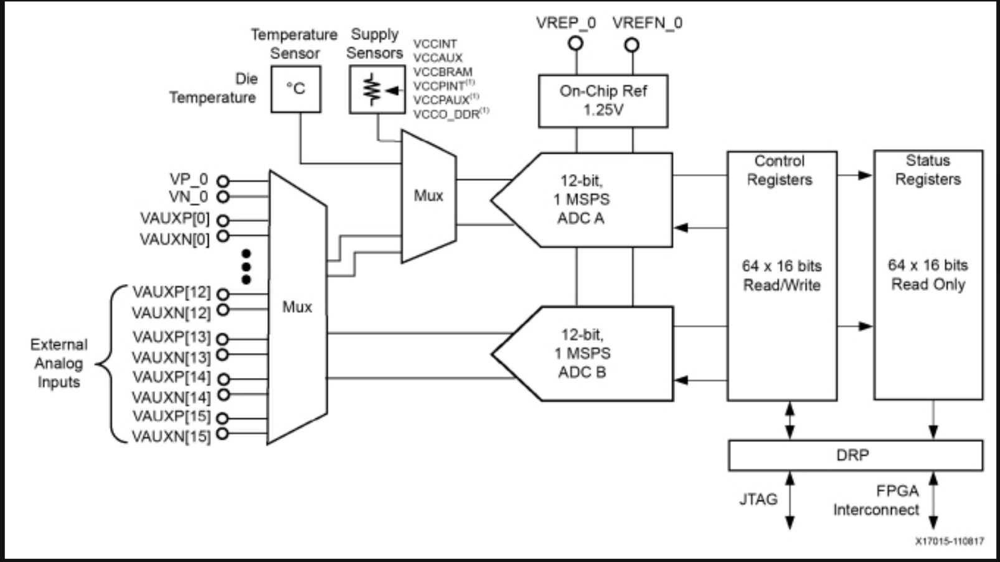
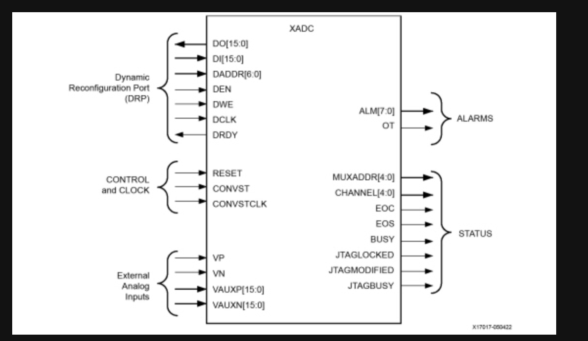

"# FPGA" 

all docs from https://docs.amd.com/r/en-US/ug480_7Series_XADC
### XADC
The signals from the XADC are on RDP interface

#### DRP interface
register address is on *daddr_in*
when conversion is done, eoc (end of conversion) is sent to den_in
register enable signal, *den_in* is seto to 1 and write enable signakl, *dwe_in* to 0
XADC retrieves data from the designated register (addres in daddr_in)
after the operation is complete, XADC places data on *do_out* and assert *drdy_out* to signal that data is ready

this reading operation takes multiple cycles, so its incopatible with fpro bus specifications (1 cycle)

channel reading;

 internal temp -> 5'b00000
internal vcc -> 5'b00001 

vauxp/n 2 -> 5'b10010
vauxp/n 3 ->5'b10011 
vauxp/n 10 -> 5'b11010 
vauxp/n 11 -> 5'b11011
